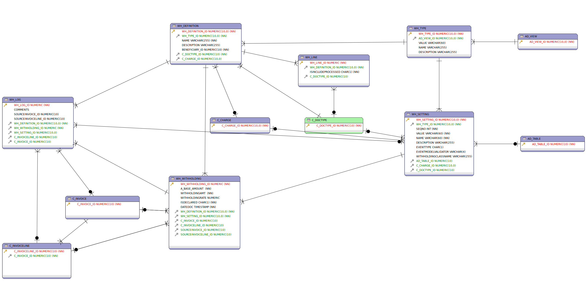

# Withholding Engine

This project is a engine definition for process vendor and customer withholding, note that is only a engine. 
If you want to use it you should implement your custom class with specific location, a example for a implementation exists here: [APInvoiceIVA.java](https://github.com/adempiere/LVE/blob/master/withholding/src/main/java/org/erpya/lve/util/APInvoiceIVA.java)

## Getting Started

- Download and install ADempiere last versión from [https://github.com/adempiere/adempiere/releases](https://github.com/adempiere/adempiere/releases)
- Download Withholding project using git user git clone [https://github.com/erpcya/Withholding](https://github.com/erpcya/Withholding)
- Set for your Client model validator class **org.spin.model.Withholding**

## License
Copyright (C) 2003-2019 E.R.P. Consultores y Asociados, C.A. All Rights Reserved.
This code have licence GNU/GPLv2 or later.

## Contact
 - Yamel Senih ysenih@erpya.com E.R.P. Consultores y Asociados, C.A.
 - Carlos Parada cparada@erpya.com E.R.P. Consultores y Asociados, C.A.
